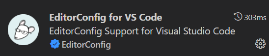
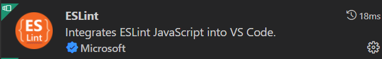
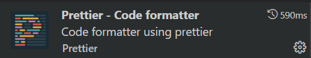

# Lints configuration

Lint tools helps maintain consistent coding styles for multiple developers working on the same project across various editors and IDEs. We recommand you to use all these linting tools during your development.

### EditorConfig

The editorConfig project consists of a file format for defining coding styles and a collection of text editor plugins that enable editors to read the file format and adhere to defined styles.

:::tip

If you are using our wab app template, `.editorConfig` is already added to `/yourProject/.vscode/.editorConfig` in our template. Just install plugin in VSCode to use it.

:::

#### To use EditorConfig in, there's two steps:

1. Install `EditorConfig for VS Code` plugin to your VS Code 👇 :



2. Add `.editorConfig` to your root level of Front end project 👇 :

```js title=".editorConfig"

root = true                          # top-most EditorConfig file

[*]
indent_size = 2
indent_style = space                 # Tab indentation -> 2 spaces
end_of_line = lf                     # Unix-style newlines with a newline ending every file
charset = utf-8                      # Default charset
trim_trailing_whitespace = true      # Trim end line whitespace
insert_final_newline = true          # Inset a new line at the end of file

```

Your editorConfig gets settle down after this two steps.

:::tip

Visual studio also comes bundled with native support for EditorConfig.

:::

For more detials about editorConfig, please check [🌏EditorConfig.org](https://editorconfig.org/).

### ESLint

ESLint is a tool for identifying and reporting on patterns found in ECMAScript/JavaScript code, with the goal of making code more consistent and avoiding bugs.

:::tip

If you are using our wab app template, `.eslintrc` is already added to `/yourProject/src/.eslintrc` in our template. Just install plugin and enable autosave in VSCode to use it.

:::

1. Install `ESLint` plugin to your VS Code 👇 :



2. Add `.eslintrc` to your root level of Front end project 👇 :

```js title=".eslintrc"

{
	"extends": [
		"plugin:react/recommended",
		"plugin:react-hooks/recommended",
		"plugin:@typescript-eslint/recommended",
		"plugin:prettier/recommended"
	],
	"plugins": ["react", "react-hooks", "@typescript-eslint", "prettier", "simple-import-sort", "typescript-sort-keys"],
	"rules": {
		"@typescript-eslint/ban-types": 0,
		"@typescript-eslint/explicit-module-boundary-types": 0,
		"@typescript-eslint/no-empty-function": 0,
		"@typescript-eslint/no-empty-interface": 0,
		"@typescript-eslint/no-explicit-any": 0,
		"@typescript-eslint/no-unused-vars": 0,
		"react/no-unknown-property": [1, { "ignore": ["class"] }],
		"eqeqeq": ["warn"],
		"linebreak-style": ["warn", "unix"],
		"no-alert": 2,
		"no-console": 0,
		"no-duplicate-imports": 2,
		"prettier/prettier": "error",
		"react/display-name": 0,
		"react/jsx-sort-props": "error",
		"react/no-danger": 1,
		"react/prop-types": 0,
		"react-hooks/rules-of-hooks": 2,
		"react-hooks/exhaustive-deps": 0,
		"react/react-in-jsx-scope": "off",
		"simple-import-sort/imports": [
			"error",
			{
				"groups": [
					["^@?\\w"], // NPM Packages
					["^(pages|stores|global|types|utils|apis|queries)(/.*|$)"], // Alias imports
					["^\\."] // Anything that starts with a dot
				]
			}
		],
		"typescript-sort-keys/interface": "error",
		"typescript-sort-keys/string-enum": "error"
	},
	"parserOptions": {
		"sourceType": "module",
		"ecmaFeatures": {
			"jsx": true
		}
	},
	"env": {
		"browser": true,
		"jest": true,
		"node": true,
		"es2020": true // adds ES 2020 globals and sets ecmaVersion to 11
	},
	"settings": {
		"react": {
			"version": "detect"
		}
	},
	"parser": "@typescript-eslint/parser"
}

```

Your `ESLint` gets settle down after this two steps. For more detials, please check [🌏ESLint.org](https://eslint.org/).

### Prettier

Prettier is an opinionated code formatter.

:::tip

If you are using our wab app template, `.prettierrc` is already added to `/yourProject/src/.prettierrc` in our template. Just install plugin and enable autosave in VSCode to use it.

:::

1. Install `Prettier` plugin to your VS Code 👇 :



2. Add `.prettierrc` to your root level of Front end project 👇 :

```js title=".prettierrc"
{
	"arrowParens": "avoid",
	"printWidth": 150,
	"semi": false,
	"singleQuote": true,
	"trailingComma": "none",
	"useTabs": true
}
```

Your `prettier` gets settle down after this two steps. For more detials, please check [🌏Prettier.io](https://prettier.io/).
