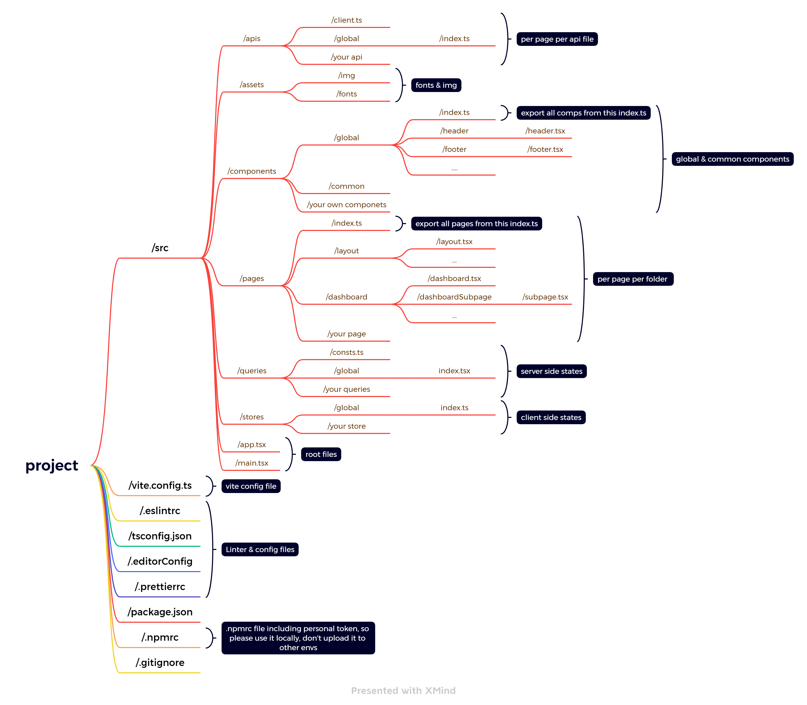

# Code structure

We followed the similar code structures for all templates:

Here's some basic rules of our code stucture:

- folder and file names are **camal case**
- website could be divided by pages, **per page per folder** under `pages`, name should be relevant with page content, path could be
  - `/pages/users/users.tsx`
- **subpage of page** could be put under page, path could be
  - `/pages/users/subPage/subPage.tsx`
- **component level code** including commonly or global or your customize component, path could be
  - `/components/global/yourGlobalComp/yourGloablComp.tsx`
  - `/components/common/yourCommonComp/yourCommonComp.tsx`
  - `/components/yourComp/yourComp.tsx`
- **assets** includes images and fonts, path could be
  - `/assets/img/yourImg`
  - `/assets/fonts/yourFonts`
- **apis** includes all apis, path could be
  - `/apis/users/users.ts` (this will includes apis using in users page)
- **stores** includes client side states, path could be
  - `/sotres/users/index.ts`
- **queries** includes query side states, path could be
  - `/queries/users/index.tsx`

:::tip

We added few index.ts under some of folders, for example `pages/index.ts`, if you add yourPage inside of this index.ts like this `export { default as YourPage } from './yourpage/yourpage'`, you could use `import { YourPage } from 'pages'` inother page to use yourPage. We are recommand to add index.ts and use index.ts to make import path clean and easy to understand.

:::

# More details?

We provided some code example and explain for your code incase you are new to template, for more details, please check next section.
